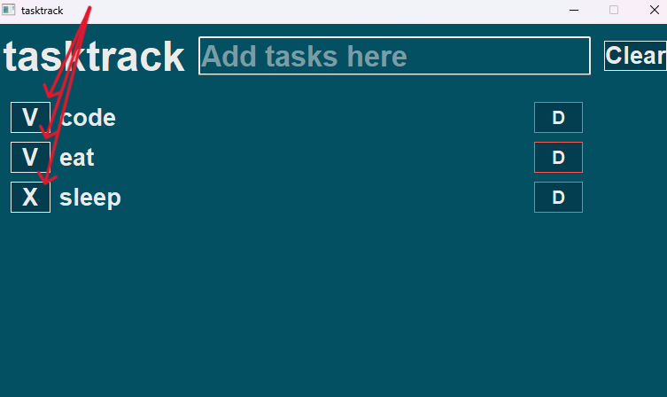
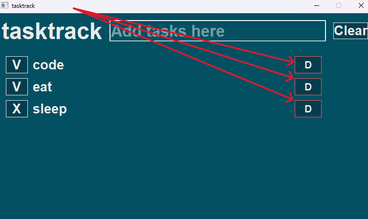
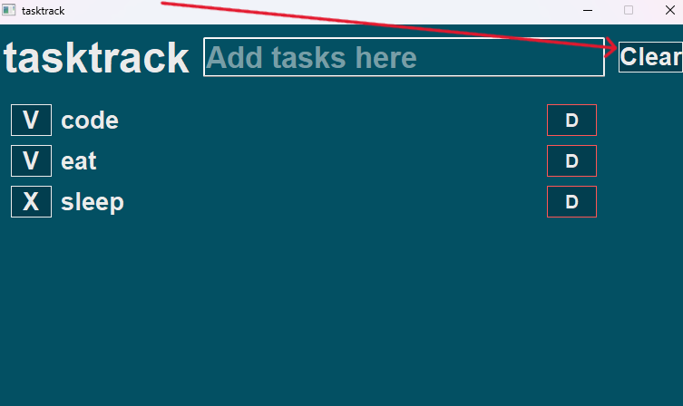

# tasktrack
Hello! This is a simple gui made with pyqt5.  \
The installer was made with inno setup.  \
It saves data in saved.json.  \
Doesn't have any subscriptions or online servers.  \
Open Source!  \
BUT Windows SmartScreen doesn't like it :(

What can you do: 
1. Add tasks using the text box on the top

2. Change task status (done/not done) using buttons on the left

3. Delete tasks using buttons on the right

4. "Clear" tasks (delete tasks that are marked done) using the clear button

Doesn't have an icon, but you can commit it to the main folder as a png!